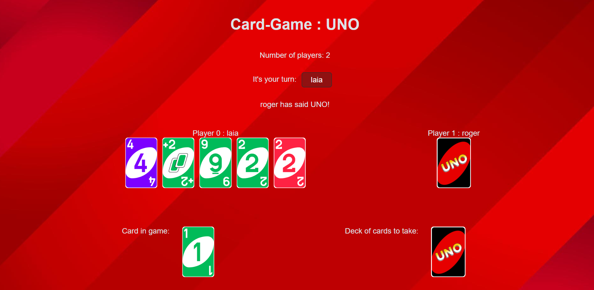

# Card game: UNO

To run the script you have to:

- Do "npm install" to create the node_modules directory in the frontend directory.
- Do "npm run dev" in the frontend directory to play the game.

To play the game you have to:

1. Indicate the number of players.
2. Indicate the name of the players.
3. Press the "Start game!" button.
4. Press the button with the player's name indicating whose turn it is. Then the player's cards will be uncovered.
5. Then, you can press the card you want to throw or pick up a card in the "deck of cards to take".
6. You can skip your turn if you pick up a card and you don't have any to throw either.
7. Every time you throw a card or pass the turn, the new player's turn is displayed on a button. To show the cards of this, you have to press the button with the player's name.
8. When you have two cards and you are going to throw one, you have to say UNO, so you have to press the "UNO" button before throw it.

